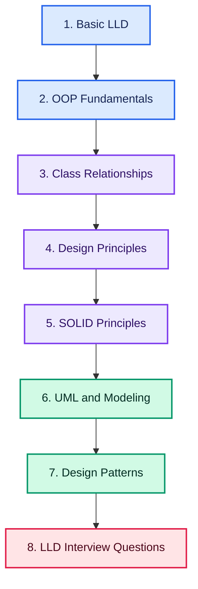

# Low Level Design (LLD) Roadmap: From Beginner to Interview-Ready Design Engineer

> A complete, practice-based learning path covering OOP fundamentals, class relationships, design principles, SOLID, UML modeling, design patterns, and real interview problems

## Quick Roadmap

**Foundations:** [Basic LLD](#basic-lld) • [OOP Fundamentals](#oop-fundamentals) • [Class Relationships](#class-relationships)

**Design Discipline:** [Design Principles](#design-principles) • [SOLID Principles](#solid-principles) • [UML & Modeling](#uml--modeling)

**Build Systems:** [Design Patterns](#design-patterns) • [LLD Interview Questions](#lld-interview-questions)

**Career Path:** [Interview Preparation](INTERVIEWS.md) • [Contributing Guide](CONTRIBUTING.md)

## Why Learn Low Level Design?

LLD interviews test whether you can turn a vague, real-world problem into clean, extensible, object-oriented code. It's a core round at most top product and service companies, and the skills — OOP discipline, SOLID thinking, and pattern recognition — carry directly into better everyday software design.

## Build Interview-Ready LLD Skills

Go beyond theory and learn how to:

- Apply OOP fundamentals correctly: classes, interfaces, encapsulation, abstraction, inheritance, polymorphism
- Model relationships between classes: association, aggregation, composition, dependency, realization
- Apply design principles (DRY, KISS, YAGNI, Law of Demeter, Separation of Concerns) and all five SOLID principles
- Represent systems with UML: class, sequence, activity, state, and use-case diagrams
- Recognize and apply the right design pattern: creational, structural, and behavioral
- Design real systems end-to-end: parking lots, elevators, rate limiters, chat apps, and more
- Practice with a structured interview-question bank organized by domain

> **Learn the principles. Apply the patterns. Design real systems.**

Follow the roadmap in order, starting with OOP fundamentals before moving into class relationships, design principles, UML, patterns, and full interview-style problems.

## Complete Learning Path

### Basic LLD

- [Practice](https://tech.examadda.org/system-design-lld/practice)
- [Roadmap](https://tech.examadda.org/system-design-lld/roadmap)
- [Beginner Interview Questions](https://tech.examadda.org/system-design-lld/beginner-interview-questions)
- [Intermediate Interview Questions](https://tech.examadda.org/system-design-lld/intermediate-interview-questions)
- [Advanced Interview Questions](https://tech.examadda.org/system-design-lld/advanced-interview-questions)
- [Scenario-Based Interview Questions](https://tech.examadda.org/system-design-lld/scenario-based-interview-questions)
- [Introduction of LLD](https://tech.examadda.org/system-design-lld/basic-lld-introduction)
- [LLD vs HLD](https://tech.examadda.org/system-design-lld/basic-lld-vs-hld)
- [Types of LLD Questions](https://tech.examadda.org/system-design-lld/basic-lld-questions)

---

### OOP Fundamentals

- [Classes](https://tech.examadda.org/system-design-lld/oop-fundamentals-classes-introduction)
  - [Introduction](https://tech.examadda.org/system-design-lld/oop-fundamentals-classes-introduction)
  - [Practice Problems](https://tech.examadda.org/system-design-lld/lld-oop-classes-practice)
- [Objects](https://tech.examadda.org/system-design-lld/oop-fundamentals-objects-introduction)
  - [Introduction](https://tech.examadda.org/system-design-lld/oop-fundamentals-objects-introduction)
  - [Practice Problems](https://tech.examadda.org/system-design-lld/lld-oop-objects-practice)
- [Enums](https://tech.examadda.org/system-design-lld/oop-fundamentals-enums-introduction)
  - [Introduction](https://tech.examadda.org/system-design-lld/oop-fundamentals-enums-introduction)
  - [Practice Problems](https://tech.examadda.org/system-design-lld/lld-oop-enums-practice)
- [Interface](https://tech.examadda.org/system-design-lld/oop-fundamentals-interface-introduction)
  - [Introduction](https://tech.examadda.org/system-design-lld/oop-fundamentals-interface-introduction)
  - [Practice Problems](https://tech.examadda.org/system-design-lld/lld-oop-interface-practice)
- [Encapsulation](https://tech.examadda.org/system-design-lld/oop-fundamentals-encapsulation-introduction)
  - [Introduction](https://tech.examadda.org/system-design-lld/oop-fundamentals-encapsulation-introduction)
  - [Practice Problems](https://tech.examadda.org/system-design-lld/lld-oops-encapsulation-practice)
- [Abstraction](https://tech.examadda.org/system-design-lld/oop-fundamentals-abstraction-introduction)
  - [Introduction](https://tech.examadda.org/system-design-lld/oop-fundamentals-abstraction-introduction)
  - [Practice Problems](https://tech.examadda.org/system-design-lld/lld-oop-abstraction-practice)
- [Inheritance](https://tech.examadda.org/system-design-lld/oop-fundamentals-inheritance-introduction)
  - [Introduction](https://tech.examadda.org/system-design-lld/oop-fundamentals-inheritance-introduction)
  - [Practice Problems](https://tech.examadda.org/system-design-lld/lld-oop-inheritance-practice)
- [Polymorphism](https://tech.examadda.org/system-design-lld/oop-fundamentals-polymorphism-introduction)
  - [Introduction](https://tech.examadda.org/system-design-lld/oop-fundamentals-polymorphism-introduction)
  - [Practice Problems](https://tech.examadda.org/system-design-lld/lld-oop-practice)
- [Immutability](https://tech.examadda.org/system-design-lld/introduction)
  - [**Introduction**](https://tech.examadda.org/system-design-lld/introduction)
- [Deep copy vs shallow copy](https://tech.examadda.org/system-design-lld/introduction)
  - [**Introduction**](https://tech.examadda.org/system-design-lld/introduction)
  - [Practice Problems](https://tech.examadda.org/system-design-lld/lld-oop-deep-copy-vs-shallow-copy-practice)
- [Method overloading vs overriding](https://tech.examadda.org/system-design-lld/introduction)
  - [**Introduction**](https://tech.examadda.org/system-design-lld/introduction)
  - [Practice Problems](https://tech.examadda.org/system-design-lld/lld-oop-method-overloading-vs-overriding-practice)
- [Object lifecycle](https://tech.examadda.org/system-design-lld/introduction)
  - [**Introduction**](https://tech.examadda.org/system-design-lld/introduction)
  - [Practice Problems](https://tech.examadda.org/system-design-lld/lld-oop-object-lifecycle-practice)

---

### Class Relationships

- [Association](https://tech.examadda.org/system-design-lld/introduction)
  - [**Introduction**](https://tech.examadda.org/system-design-lld/introduction)
  - [Practice Problems](https://tech.examadda.org/system-design-lld/lld-class-relationship-practice-association)
- [Aggregation](https://tech.examadda.org/system-design-lld/introduction)
  - [**Introduction**](https://tech.examadda.org/system-design-lld/introduction)
  - [Practice Problems](https://tech.examadda.org/system-design-lld/lld-class-relationship-practice-aggregation)
- [Composition](https://tech.examadda.org/system-design-lld/introduction)
  - [**Introduction**](https://tech.examadda.org/system-design-lld/introduction)
  - [Practice Problems](https://tech.examadda.org/system-design-lld/lld-class-relationship-practice-composition)
- [Dependency](https://tech.examadda.org/system-design-lld/introduction)
  - [**Introduction**](https://tech.examadda.org/system-design-lld/introduction)
  - [Practice Problems](https://tech.examadda.org/system-design-lld/lld-class-relationship-practice-dependency)
- [Realization](https://tech.examadda.org/system-design-lld/introduction)
  - [**Introduction**](https://tech.examadda.org/system-design-lld/introduction)
  - [Practice Problems](https://tech.examadda.org/system-design-lld/lld-class-relationship-practice-realization)

---

### Design Principles

- [DRY Principle](https://tech.examadda.org/system-design-lld/introduction)
  - [**Introduction**](https://tech.examadda.org/system-design-lld/introduction)
  - [Practice Problems](https://tech.examadda.org/system-design-lld/lld-design-principles-practice-dry)
- [KISS Principle](https://tech.examadda.org/system-design-lld/lld-design-principles-kiss-practice)
  - [**Introduction**](https://tech.examadda.org/system-design-lld/introduction)
  - [Practice Problems](https://tech.examadda.org/system-design-lld/lld-design-principles-kiss-practice)
- [YAGNI Principle](https://tech.examadda.org/system-design-lld/introduction)
  - [**Introduction**](https://tech.examadda.org/system-design-lld/introduction)
  - [Practice Problems](https://tech.examadda.org/system-design-lld/lld-design-principles-yagni-principle)
- [Law of Demeter](https://tech.examadda.org/system-design-lld/introduction)
  - [**Introduction**](https://tech.examadda.org/system-design-lld/introduction)
  - [Practice Problems](https://tech.examadda.org/system-design-lld/lld-design-principles-law-of-demeter-practice)
- [Separation of Concerns](https://tech.examadda.org/system-design-lld/introduction)
  - [**Introduction**](https://tech.examadda.org/system-design-lld/introduction)
  - [Practice Problems](https://tech.examadda.org/system-design-lld/lld-design-principles-separation-of-concerns-practice)
- [Coupling and Cohesion](https://tech.examadda.org/system-design-lld/introduction)
  - [**Introduction**](https://tech.examadda.org/system-design-lld/introduction)
  - [Practice Problems](https://tech.examadda.org/system-design-lld/lld-design-principles-coupling-and-cohesion-practice)
- [Composing Objects Principle](https://tech.examadda.org/system-design-lld/introduction)
  - [**Introduction**](https://tech.examadda.org/system-design-lld/introduction)
  - [Practice Problems](https://tech.examadda.org/system-design-lld/lld-design-principles-composing-objects-principle-practice)

---

### SOLID Principles

- [Single Responsibility](https://tech.examadda.org/system-design-lld/introduction)
  - [**Introduction**](https://tech.examadda.org/system-design-lld/introduction)
  - [Practice Problems](https://tech.examadda.org/system-design-lld/lld-solid-principles-practice-single-responsibility)
- [Open Closed](https://tech.examadda.org/system-design-lld/introduction)
  - [**Introduction**](https://tech.examadda.org/system-design-lld/introduction)
  - [Practice Problems](https://tech.examadda.org/system-design-lld/lld-solid-principles-practice-open-closed)
- [Liskov Substitution](https://tech.examadda.org/system-design-lld/introduction)
  - [**Introduction**](https://tech.examadda.org/system-design-lld/introduction)
  - [Practice Problems](https://tech.examadda.org/system-design-lld/lld-solid-principles-practice-liskov-substitution)
- [Interface Segregation](https://tech.examadda.org/system-design-lld/introduction)
  - [**Introduction**](https://tech.examadda.org/system-design-lld/introduction)
  - [Practice Problems](https://tech.examadda.org/system-design-lld/lld-solid-principles-practice-interface-segregation)
- [Dependency Inversion](https://tech.examadda.org/system-design-lld/introduction)
  - [**Introduction**](https://tech.examadda.org/system-design-lld/introduction)
  - [Practice Problems](https://tech.examadda.org/system-design-lld/lld-solid-principles-practice-dependency-inversion)

---

### UML & Modeling

- Structural Diagrams

  - [Class diagram](https://tech.examadda.org/system-design-lld/introduction)
    - [**Introduction**](https://tech.examadda.org/system-design-lld/introduction)
    - [Practice Problems](https://tech.examadda.org/system-design-lld/practice-problems)
  - [ER diagram](https://tech.examadda.org/system-design-lld/lld-uml-and-modelling-techniques-identifying-structural-er-diagrams)
  - [Component diagram](https://tech.examadda.org/system-design-lld/lld-uml-and-modelling-techniques-identifying-structural-component-diagrams)
  - [Deployment diagram](https://tech.examadda.org/system-design-lld/lld-uml-and-modelling-techniques-identifying-structural-deployment-diagram)

- Behavioral Diagrams

  - [Sequence diagram](https://tech.examadda.org/system-design-lld/lld-uml-and-modelling-techniques-behavioral-diagrams-sequence)
  - [Activity diagram](https://tech.examadda.org/system-design-lld/lld-uml-and-modelling-techniques-behavioral-diagrams-activity)
  - [State diagram](https://tech.examadda.org/system-design-lld/lld-uml-and-modelling-techniques-behavioral-diagrams-state)
  - [Use case diagram](https://tech.examadda.org/system-design-lld/lld-uml-and-modelling-techniques-behavioral-diagrams-use-case)

- Modeling Techniques

  - [Identifying entities](https://tech.examadda.org/system-design-lld/lld-uml-and-modelling-techniques-identifying-entities)
  - [Identifying relationships](https://tech.examadda.org/system-design-lld/lld-uml-and-modelling-techniques-identifying-relationships)
  - [Multiplicity](https://tech.examadda.org/system-design-lld/lld-uml-and-modelling-techniques-multiplicity)
  - [Aggregation vs Composition](https://tech.examadda.org/system-design-lld/lld-uml-and-modelling-techniques-aggregation-vs-composition)
  - [Association types](https://tech.examadda.org/system-design-lld/lld-uml-and-modelling-techniques-association-types)
  - [Designing extensible hierarchies](https://tech.examadda.org/system-design-lld/lld-uml-and-modelling-techniques-designing-extensible-hierarchies)

---

### Design Patterns

- [Introductions](https://tech.examadda.org/system-design-lld/lld-design-patterns-introduction)

- Creational Patterns

  - [Singleton Design Pattern](https://tech.examadda.org/system-design-lld/introduction)
    - [**Introduction**](https://tech.examadda.org/system-design-lld/introduction)
    - [Practice Problems](https://tech.examadda.org/system-design-lld/lld-design-patterns-creational-practice-singleton)
  - [Factory](https://tech.examadda.org/system-design-lld/introduction)
    - [**Introduction**](https://tech.examadda.org/system-design-lld/introduction)
    - [Practice Problems](https://tech.examadda.org/system-design-lld/lld-design-patterns-creational-practice-factory)
  - [Abstract Factory](https://tech.examadda.org/system-design-lld/introduction)
    - [**Introduction**](https://tech.examadda.org/system-design-lld/introduction)
    - [Practice Problems](https://tech.examadda.org/system-design-lld/lld-design-pattern-creational-practice-abstract-factory)
  - [Builder](https://tech.examadda.org/system-design-lld/introduction)
    - [**Introduction**](https://tech.examadda.org/system-design-lld/introduction)
    - [Practice Problems](https://tech.examadda.org/system-design-lld/lld-design-patterns-creational-practice-builder)
  - [Prototype](https://tech.examadda.org/system-design-lld/introduction)
    - [**Introduction**](https://tech.examadda.org/system-design-lld/introduction)
    - [Practice Problems](https://tech.examadda.org/system-design-lld/lld-design-patterns-creational-practice-prototype)

- Structural Patterns

  - [Adapter](https://tech.examadda.org/system-design-lld/introduction)
    - [**Introduction**](https://tech.examadda.org/system-design-lld/introduction)
    - [Practice Problems](https://tech.examadda.org/system-design-lld/lld-design-patterns-structural-practice-adaptor)
  - [Bridge](https://tech.examadda.org/system-design-lld/introduction)
    - [**Introduction**](https://tech.examadda.org/system-design-lld/introduction)
    - [Practice Problems](https://tech.examadda.org/system-design-lld/lld-design-patterns-structural-practice-bridge)
  - [Composite](https://tech.examadda.org/system-design-lld/introduction)
    - [**Introduction**](https://tech.examadda.org/system-design-lld/introduction)
    - [Practice Problems](https://tech.examadda.org/system-design-lld/lld-design-patterns-structural-practice-composite)
  - [Decorator](https://tech.examadda.org/system-design-lld/introduction)
    - [**Introduction**](https://tech.examadda.org/system-design-lld/introduction)
    - [Practice Problems](https://tech.examadda.org/system-design-lld/lld-design-patterns-structural-practice-decorator)
  - [Facade](https://tech.examadda.org/system-design-lld/introduction)
    - [**Introduction**](https://tech.examadda.org/system-design-lld/introduction)
    - [Practice Problems](https://tech.examadda.org/system-design-lld/lld-design-patterns-structural-practice-facade)
  - [Proxy](https://tech.examadda.org/system-design-lld/introduction)
    - [**Introduction**](https://tech.examadda.org/system-design-lld/introduction)
    - [Practice Problems](https://tech.examadda.org/system-design-lld/lld-design-patterns-structural-practice-proxy)
  - [Flyweight](https://tech.examadda.org/system-design-lld/introduction)
    - [**Introduction**](https://tech.examadda.org/system-design-lld/introduction)
    - [Practice Problems](https://tech.examadda.org/system-design-lld/lld-design-patterns-structural-practice-flyweight)

- Behavioral Patterns

  - [Observer](https://tech.examadda.org/system-design-lld/lld-design-patterns-behavioral-observer)
  - [Strategy](https://tech.examadda.org/system-design-lld/lld-design-patterns-behavioral-strategy)
  - [Iterator](https://tech.examadda.org/system-design-lld/lld-patterns-design-behavioral-iterator)
  - [Command](https://tech.examadda.org/system-design-lld/lld-design-patterns-behavioral-command)
  - [State](https://tech.examadda.org/system-design-lld/lld-design-patterns-behavioral-state)
  - [Template Method](https://tech.examadda.org/system-design-lld/lld-design-patterns-behavioral-template-method)
  - [Chain of Responsibility](https://tech.examadda.org/system-design-lld/lld-design-patterns-behavioral-chain-of-responsibility)
  - [Visitor](https://tech.examadda.org/system-design-lld/lld-design-patterns-behavioral-visitor)
  - [Mediator](https://tech.examadda.org/system-design-lld/lld-design-patterns-behavioral-mediator)
  - [Memento](https://tech.examadda.org/system-design-lld/lld-design-patterns-behavioral-memento)

- Additional Patterns

  - [Null Object Pattern](https://tech.examadda.org/system-design-lld/lld-design-patterns-additional-null-object)
  - [Repository Pattern](https://tech.examadda.org/system-design-lld/lld-design-patterns-additional-repository)
  - [MVC Pattern](https://tech.examadda.org/system-design-lld/lld-design-patterns-additional-mvc)
  - [Dependency Injection Pattern](https://tech.examadda.org/system-design-lld/lld-design-patterns-additional-dependency-injection)
  - [Specification Pattern](https://tech.examadda.org/system-design-lld/lld-design-patterns-additional-null-specification)
  - [Game Loop Pattern](https://tech.examadda.org/system-design-lld/lld-design-patterns-additional-game-loop)
  - [Thread Pool Pattern](https://tech.examadda.org/system-design-lld/lld-design-patterns-additional-thread-pool)
  - [Producer-Consumer Pattern](https://tech.examadda.org/system-design-lld/producer-consumer-pattern)

---

### LLD Interview Questions

- Games & Puzzles

  - [Tic Tac Toe](https://tech.examadda.org/system-design-lld/lld-interview-questions-games-and-puzzles-tic-tac-toe)
  - [Snake and Ladder](https://tech.examadda.org/system-design-lld/lld-interview-questions-games-and-puzzles-sanke-and-ladder)
  - [Design Minesweeper](https://tech.examadda.org/system-design-lld/lld-interview-questions-games-and-puzzles-design-minesweeper)
  - [Design Chess](https://tech.examadda.org/system-design-lld/lld-interview-questions-games-and-puzzles-design-chess)

- Data Structures & Search

  - [Design LRU Cache](https://tech.examadda.org/system-design-lld/lld-interview-questions-data-structures-search-designs-design-lru-cache)
  - [Design Bloom Filter](https://tech.examadda.org/system-design-lld/lld-interview-questions-data-structures-search-designs-design-bloom-filter)
  - [Search Autocomplete](https://tech.examadda.org/system-design-lld/lld-interview-questions-data-structures-search-designs-search-autocomplete)
  - [Simple Search Engine](https://tech.examadda.org/system-design-lld/lld-interview-questions-data-structures-search-designs-simple-search-engine)

- Managing States

  - [Design ATM](https://tech.examadda.org/system-design-lld/lld-interview-questions-managing-states-design-atm)
  - [Vending Machine](https://tech.examadda.org/system-design-lld/lld-interview-questions-managing-states-vending-machine)
  - [Elevator System](https://tech.examadda.org/system-design-lld/lld-interview-questions-managing-states-elevator-system)
  - [Traffic Control System](https://tech.examadda.org/system-design-lld/lld-interview-questions-managing-states-traffic-control)
  - [Coffee Vending Machine](https://tech.examadda.org/system-design-lld/lld-interview-questions-managing-states-design-coffee-vending-machine)

- Management Systems

  - [Design Parking Lot](https://tech.examadda.org/system-design-lld/lld-interview-questions-management-systems-design-parking-lot)
  - [Task Management System](https://tech.examadda.org/system-design-lld/lld-interview-questions-management-systems-task-management-system)
  - [Inventory Management System](https://tech.examadda.org/system-design-lld/lld-interview-questions-management-systems-inventory-management-system)
  - [Library Management System](https://tech.examadda.org/system-design-lld/lld-interview-questions-management-systems-library)
  - [Restaurant Management System](https://tech.examadda.org/system-design-lld/lld-interview-questions-management-systems-restaurant)

- Social & Content Platforms

  - [Stack Overflow](https://tech.examadda.org/system-design-lld/lld-interview-questions-social-content-platforms-stack-overflow)
  - [Design Social Network](https://tech.examadda.org/system-design-lld/lld-interview-questions-social-content-platforms-design-social-network)
  - [Online Learning Platform](https://tech.examadda.org/system-design-lld/lld-interview-questions-social-content-platforms-online-learning-platform)
  - [Design CricInfo](https://tech.examadda.org/system-design-lld/lld-interview-questions-social-content-platforms-design-cricinfo)
  - [Design LinkedIn](https://tech.examadda.org/system-design-lld/lld-interview-questions-social-content-platforms-design-linkedin)
  - [Design Spotify](https://tech.examadda.org/system-design-lld/lld-interview-questions-social-content-platforms-spotify)

- E-commerce & Booking Systems

  - [Design Amazon Locker](https://tech.examadda.org/system-design-lld/lld-interview-questions-ecommerce-booking-systems-amazon-locker)
  - [Design Shopping Cart](https://tech.examadda.org/system-design-lld/lld-interview-questions-ecommerce-booking-systems-design-shopping-cart)
  - [Design Amazon](https://tech.examadda.org/system-design-lld/lld-interview-questions-ecommerce-booking-systems-amazon)
  - [Movie Booking System](https://tech.examadda.org/system-design-lld/lld-interview-questions-ecommerce-booking-systems-movie-booking)
  - [Car Rental System](https://tech.examadda.org/system-design-lld/lld-interview-questions-ecommerce-booking-systems-car-rental)
  - [Meeting Scheduler](https://tech.examadda.org/system-design-lld/lld-interview-questions-ecommerce-booking-systems-meeting-scheduler)
  - [Online Auction System](https://tech.examadda.org/system-design-lld/lld-interview-questions-ecommerce-booking-systems-online-auction)
  - [Online Food Delivery Service](https://tech.examadda.org/system-design-lld/lld-interview-questions-ecommerce-booking-systems-online-food-delivery-service)
  - [Ride Hailing Service](https://tech.examadda.org/system-design-lld/lld-interview-questions-ecommerce-booking-systems-ride-hailing-service)

- Communication & Messaging

  - [Design Notification System](https://tech.examadda.org/system-design-lld/lld-interview-questions-communication-messaging-systems-notification)
  - [Design Pub-Sub System](https://tech.examadda.org/system-design-lld/lld-interview-questions-communication-messaging-systems-pub-sub)
  - [Design Chat Application](https://tech.examadda.org/system-design-lld/lld-interview-questions-communication-messaging-systems-chat-application)

- Financial & Payment Systems

  - [Design Splitwise](https://tech.examadda.org/system-design-lld/lld-interview-questions-financial-payment-systems-splitwise)
  - [Design Payment Gateway](https://tech.examadda.org/system-design-lld/lld-interview-questions-financial-payment-systems-payment-gateway)
  - [Design Online Stock Exchange](https://tech.examadda.org/system-design-lld/lld-interview-questions-financial-payment-systems-online-stock-exchange)

- Developer Tools & Infrastructure

  - [Design URL Shortener](https://tech.examadda.org/system-design-lld/lld-interview-questions-developer-tools-infrastructure-url-shortner)
  - [Design Logging Framework](https://tech.examadda.org/system-design-lld/lld-interview-questions-developer-tools-infrastructure-design-logging-framework)
  - [Design Rate Limiter](https://tech.examadda.org/system-design-lld/lld-interview-questions-developer-tools-infrastructure-design-rate-limiter)
  - [Design In-Memory File System](https://tech.examadda.org/system-design-lld/lld-interview-questions-developer-tools-infrastructure-design-in-memory-file-system)
  - [Design Version Control System](https://tech.examadda.org/system-design-lld/lld-interview-questions-developer-tools-infrastructure-design-version-control-system)
  - [Design Task Scheduler](https://tech.examadda.org/system-design-lld/lld-interview-questions-developer-tools-infrastructure-design-task-scheduler)

---

## Interview Preparation

Prepare for LLD interviews with level-based questions and practical scenarios.

| Level | Resource |
|:---:|---|
| 🟢 Beginner | [Beginner LLD Interview Questions](https://tech.examadda.org/system-design-lld/beginner-interview-questions) |
| 🟡 Intermediate | [Intermediate LLD Interview Questions](https://tech.examadda.org/system-design-lld/intermediate-interview-questions) |
| 🔴 Advanced | [Advanced LLD Interview Questions](https://tech.examadda.org/system-design-lld/advanced-interview-questions) |
| 🟣 Scenario-Based | [Scenario-Based LLD Interview Questions](https://tech.examadda.org/system-design-lld/scenario-based-interview-questions) |

For structured preparation, follow the complete [LLD Interview Preparation Guide](INTERVIEWS.md).

Focus on identifying entities and relationships, choosing the right pattern (not over-engineering), applying SOLID cleanly, handling concurrency/state where relevant, and being able to extend your design when the interviewer adds new requirements.

## 12-Week Balanced Learning Plan

| Weeks | Learning Focus | Milestone |
|:---:|---|---|
| 1–2 | Basic LLD, OOP fundamentals (classes, interfaces, encapsulation, inheritance, polymorphism) | Small OOP modeling exercise |
| 3 | Class relationships (association, aggregation, composition, dependency, realization) | Class diagram for a sample domain |
| 4 | Design principles: DRY, KISS, YAGNI, Law of Demeter, coupling & cohesion | Refactor a messy code sample |
| 5 | SOLID principles | Apply all 5 SOLID principles to one system |
| 6 | UML & modeling techniques | Full UML diagram set for a chosen system |
| 7–8 | Creational & structural design patterns | Implement 4–5 patterns in code |
| 9–10 | Behavioral & additional design patterns | Implement 4–5 more patterns in code |
| 11 | Practice: state machines & management systems (ATM, parking lot, elevator) | 2–3 solved LLD problems |
| 12 | Practice: platforms & infrastructure (chat app, rate limiter, URL shortener) | Capstone LLD write-up + interview revision |

> Complete each milestone as a documented GitHub project (code + UML diagrams) to build an interview-ready portfolio.

## Contributing

Corrections, explanations, test cases and implementations are welcome. Read [CONTRIBUTING.md](CONTRIBUTING.md) before opening a pull request.

## About ExamAdda

[ExamAdda](https://examadda.org) is an all-in-one platform for mastering DSA, system design, development skills, and coding interviews through structured courses, hands-on practice, company-wise questions, and mock interviews.

**Learn smarter. Practice consistently. Crack top tech interviews.**

[Start Learning](https://tech.examadda.org/) • [Explore Courses](https://tech.examadda.org/courses/) • [Unlock ExamAdda Premium](https://examadda.org/premium)

## License

This repository is available under the [MIT License](LICENSE).
